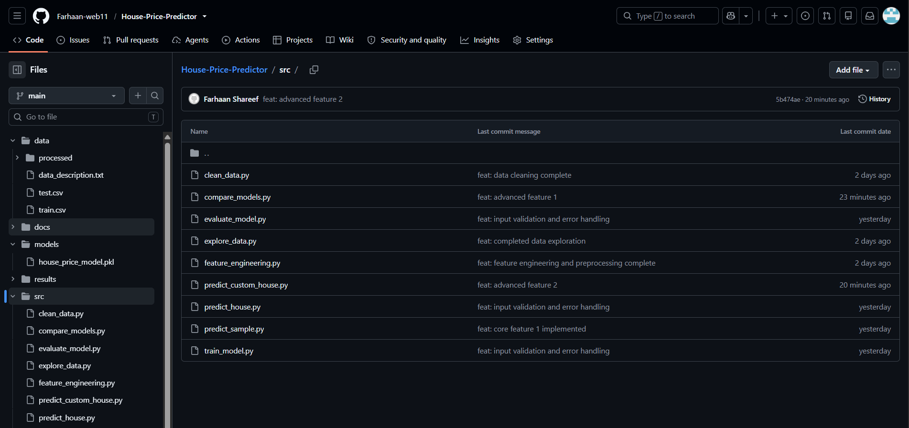
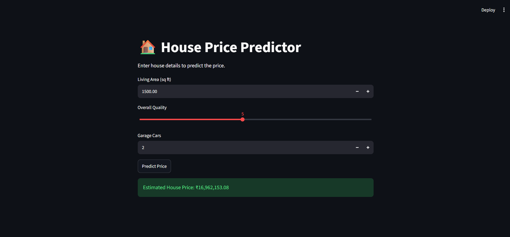
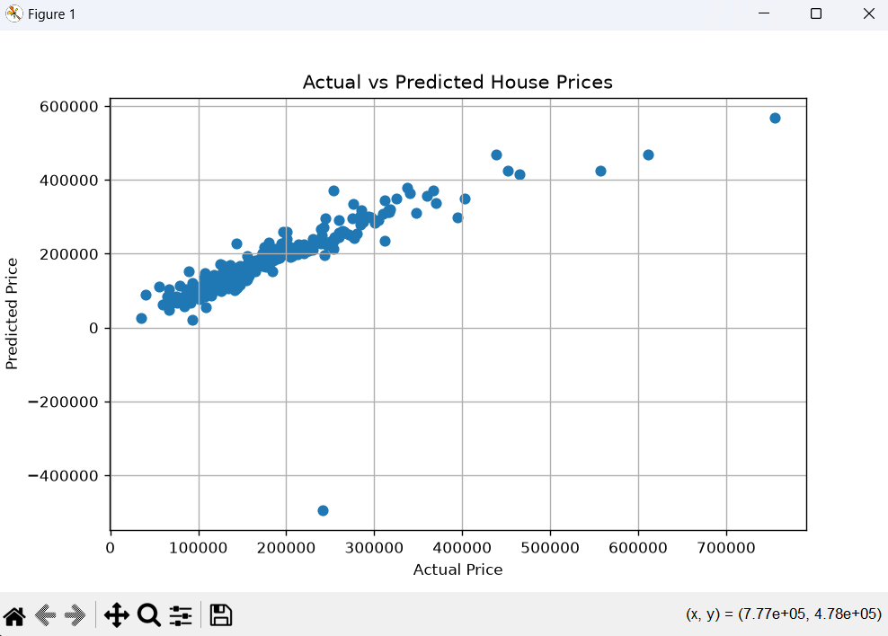

# 🏠 House Price Predictor

## 📌 Project Description

The **House Price Predictor** is a machine learning project developed as part of the **CodeZoner AI & Machine Learning Internship**. It analyzes housing data, trains machine learning models, evaluates their performance, and predicts house prices based on selected house features. The project demonstrates the complete machine learning workflow, from data preprocessing and feature engineering to model training, evaluation, prediction, and deployment using Streamlit.

---

## 🌐 Live Demo

**Live Application**

https://house-price-predictor-qdcutwz5ashcd2qgsu2dxi.streamlit.app

---

## 📸 Screenshots

The following screenshots demonstrate different stages of the project.

### 📁 GitHub Repository

Complete source code, documentation, datasets, and project files.

**View Image:**
https://github.com/Farhaan-web11/House-Price-Predictor/blob/main/images/github_repo.png



---

### 📊 Data Exploration

Exploratory Data Analysis (EDA) performed on the housing dataset.

**View Image:**
https://github.com/Farhaan-web11/House-Price-Predictor/blob/main/docs/exploration.png


---

### ⚙️ Feature Engineering

Data preprocessing, feature engineering, feature encoding, and scaling.

**View Image:**
https://github.com/Farhaan-web11/House-Price-Predictor/blob/main/docs/feature_engineering.png


---

### 🏠 House Price Prediction

Prediction interface built using Streamlit.

**View Image:**
https://github.com/Farhaan-web11/House-Price-Predictor/blob/main/images/prediction.png



---

### 📈 Model Evaluation

Actual vs Predicted House Prices graph generated during evaluation.

**View Image:**
https://github.com/Farhaan-web11/House-Price-Predictor/blob/main/images/evaluation_graph.png



---

## ✨ Features

* Data exploration and analysis
* Data cleaning and preprocessing
* Feature engineering
* Train/Test data split
* Linear Regression model training
* Multiple model comparison
* House price prediction
* Model evaluation using MAE, MSE, RMSE, and R² Score
* Input validation and error handling
* Testing and debugging
* Streamlit web interface
* GitHub version control

---

## 🛠️ Tech Stack

### Programming Language

* Python

### Libraries

* Pandas
* NumPy
* Scikit-learn
* Matplotlib
* Joblib
* Streamlit

### Tools

* Visual Studio Code
* Git
* GitHub
* Streamlit Community Cloud

---

## 📂 Project Structure

```text
House-Price-Predictor/
│
├── data/
├── docs/
├── images/
├── models/
├── results/
├── src/
├── tests/
├── app.py
├── requirements.txt
└── README.md
```

---

## ⚙️ Setup Instructions

### Clone the Repository

```bash
git clone https://github.com/Farhaan-web11/House-Price-Predictor.git
```

### Move into the Project Folder

```bash
cd House-Price-Predictor
```

### Install Dependencies

```bash
pip install -r requirements.txt
```

### Run the Application

If using Streamlit:

```bash
streamlit run app.py
```

If the `streamlit` command is not recognized:

```bash
python -m streamlit run app.py
```

Or run the Python scripts individually:

```bash
python src/explore_data.py
python src/feature_engineering.py
python src/train_model.py
python src/evaluate_model.py
python src/predict_house.py
```

---

## 📊 Model Evaluation

The project evaluates the machine learning model using:

* Mean Absolute Error (MAE)
* Mean Squared Error (MSE)
* Root Mean Squared Error (RMSE)
* R² Score

---

## 🚀 Future Improvements

* Improve prediction accuracy using additional machine learning algorithms.
* Add more advanced feature engineering.
* Improve the Streamlit user interface.
* Deploy future versions with additional visualizations.
* Support user-uploaded datasets for prediction.

---

## 👨‍💻 Author

**Farhaan Shareef**

AI & Machine Learning Internship – CodeZoner

GitHub: https://github.com/Farhaan-web11
