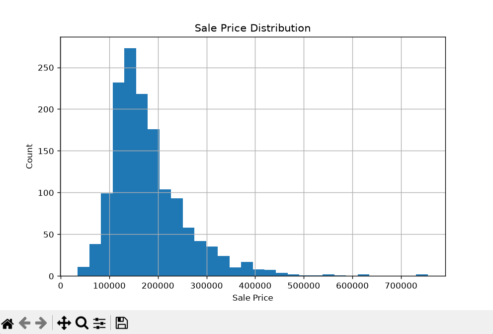
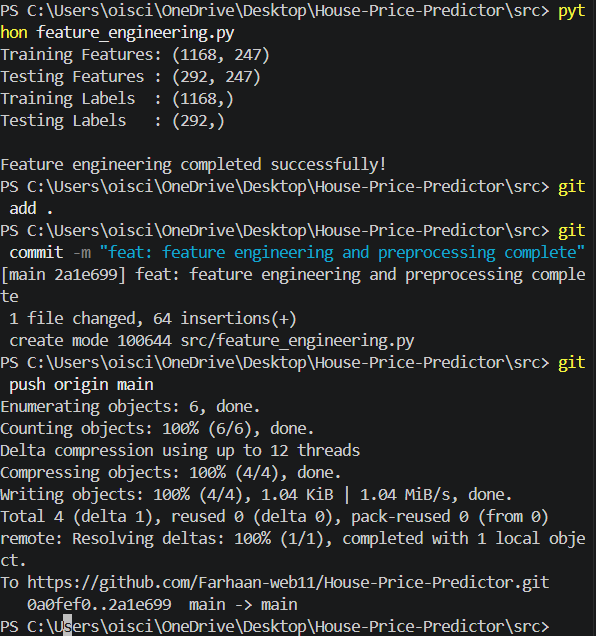

# House Price Predictor

## Student Information

- **Name:** Farhaan Shareef
- **Student ID:** CZ-2026-0189
- **Batch:** July 2026

---

# Problem Statement

The objective of this project is to build a Machine Learning model that predicts house prices based on various features such as house size, number of bedrooms, bathrooms, overall quality, and location.

---

# Dataset Source

- Kaggle - House Prices: Advanced Regression Techniques

Files used:
- train.csv
- test.csv
- data_description.txt

---

# Project Approach

1. Download the dataset
2. Explore the dataset
3. Clean missing values
4. Create new features
5. Encode categorical variables
6. Scale numerical features
7. Split data into training and testing sets
8. Train Machine Learning models
9. Evaluate model performance
10. Predict house prices

---

# Technologies Used

- Python
- Pandas
- NumPy
- Matplotlib
- Scikit-learn
- Git
- GitHub
- Visual Studio Code

---

# Project Structure

```
House-Price-Predictor/
│
├── data/
├── docs/
├── src/
└── README.md
```

---

# Screenshots

## Data Exploration



## Feature Engineering



---

# Author

Farhaan Shareef
## Features Completed

- Dataset exploration
- Data cleaning
- Feature engineering
- Train/Test split
- Linear Regression model
- Model evaluation
- House price prediction
- Error handling
- Testing
- GitHub version control

## Current Project Status

✅ Week 1 Completed

✅ Week 2 (Days 8–13) Completed

The project can train a machine learning model, evaluate its performance, and predict house prices using processed data.
## Advanced Features

- Compared multiple Machine Learning algorithms
- Evaluated each model using R² Score
- Selected the best-performing model automatically
## Performance Improvements

- Saved trained model using Joblib for faster predictions.
- Reused processed datasets instead of repeating preprocessing.
- Optimized Random Forest parameters during development.
- Reduced unnecessary file loading.
- Added caching for the Streamlit app (if applicable).
## 🚀 Quick Start

### 1. Clone the repository

```bash
git clone https://github.com/Farhaan-web11/House-Price-Predictor.git
```

### 2. Install dependencies

```bash
pip install pandas numpy matplotlib scikit-learn joblib streamlit
```

### 3. Run the application

If using Streamlit:

```bash
streamlit run app.py
```

Or run the Python scripts:

```bash
python src/train_model.py
python src/evaluate_model.py
python src/predict_house.py
```